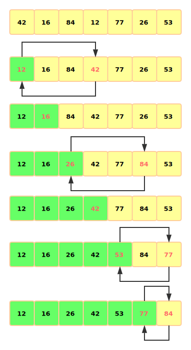

# 第二章 排序

## 2.1 初级排序算法

### 2.1.1 游戏规则



```java
import edu.princeton.cs.algs4.StdIn;
import edu.princeton.cs.algs4.StdOut;

public class Example {
    public static void sort(Comparable[] a) {

    }

    private static boolean less(Comparable v, Comparable w) {
        return v.compareTo(w) < 0;
    }

    private static void exch(Comparable[] a, int i, int j) {
        Comparable t = a[i];
        a[i] = a[j];
        a[j] = t;
    }

    private static void show(Comparable[] a) {
        for (int i = 0; i < a.length; i++)
            StdOut.print(a[i] + " ");
        StdOut.println();
    }

    public static boolean isSorted(Comparable[] a) {
        for (int i = 0; i < a.length; i++)
            if (less(a[i], a[i - 1])) return false;
        return true;
    }

    public static void main(String[] args) {
        String[] a = StdIn.readAllStrings();
        sort(a);
        assert isSorted(a);
        show(a);
    }
}
```



#### 2.1.1.1 验证

#### 2.1.1.2 运行时间

#### 2.1.1.3 额外的内存使用

#### 2.1.1.4 数据类型

### 2.1.2 选择排序

$$
长度为N的数组，选择排序需要大约N^2/2次比较和N次交换。
$$

选择排序特点：

1. 运行时间和输入无关。
2. 数据移动是最少的。



```java
public class Selection {
    public static void sort(Comparable[] a) {
        int N = a.length;
        for (int i = 0; i < N; i++) {
            int min = i;
            for (int j = i + 1; j < N; j++)
                if (less(a[j], a[min])) min = j;
            exch(a, i, min);
        }
    }

    private static boolean less(Comparable v, Comparable w) {
        return v.compareTo(w) < 0;
    }

    private static void exch(Comparable[] a, int i, int j) {
        Comparable t = a[i];
        a[i] = a[j];
        a[j] = t;
    }

    private static void show(Comparable[] a) {
        for (int i = 0; i < a.length; i++)
            StdOut.print(a[i] + " ");
        StdOut.println();
    }

    public static boolean isSorted(Comparable[] a) {
        for (int i = 0; i < a.length; i++)
            if (less(a[i], a[i - 1])) return false;
        return true;
    }

    public static void main(String[] args) {
        String[] a = {"S", "O", "R", "T", "E", "X", "A", "M", "P", "L", "E"};
        sort(a);
        assert isSorted(a);
        show(a);
    }
}
```

### 2.1.3 插入排序

```java
public class Insertion {
    public static void sort(Comparable[] a) {
        int N = a.length;
        for (int i = 1; i < N; i++) {
            //依次向前比较交换实现插入效果
            for (int j = i; j >0 && less(a[j],a[j-1]) ; j--) {
                exch(a,j,j-1);
            }
        }
    }

    private static boolean less(Comparable v, Comparable w) {
        return v.compareTo(w) < 0;
    }

    private static void exch(Comparable[] a, int i, int j) {
        Comparable t = a[i];
        a[i] = a[j];
        a[j] = t;
    }

    private static void show(Comparable[] a) {
        for (int i = 0; i < a.length; i++)
            StdOut.print(a[i] + " ");
        StdOut.println();
    }

    public static boolean isSorted(Comparable[] a) {
        for (int i = 0; i < a.length; i++)
            if (less(a[i], a[i - 1])) return false;
        return true;
    }

    public static void main(String[] args) {
        String[] a = {"S", "O", "R", "T", "E", "X", "A", "M", "P", "L", "E"};
        sort(a);
        assert isSorted(a);
        show(a);
    }
}
```

### 2.1.4 排序算法的可视化

### 2.1.5 比较两种排序算法

```java
import edu.princeton.cs.algs4.StdOut;
import edu.princeton.cs.algs4.StdRandom;
import edu.princeton.cs.algs4.Stopwatch;
public class SortCompare {
    public static double time(String alg, Comparable[] a) {
        Stopwatch timer = new Stopwatch();
        if (alg.equals("Insertion")) Insertion.sort(a);
        if (alg.equals("Selection")) Selection.sort(a);
        if (alg.equals("Shell")) Shell.sort(a);
        if (alg.equals("Merge")) Merge.sort(a);
        if (alg.equals("Quick")) Quick.sort(a);
        if (alg.equals("Heap")) Heap.sort(a);
        return timer.elapsedTime();
    }

    public static double timeRandomInput(String alg, int N, int T) {
        double total = 0.0;
        Double[] a = new Double[N];
        for (int t = 0; t < T; t++) {
            for (int i = 0; i < N; i++)
                a[i] = StdRandom.uniform();
            total += time(alg, a);
        }
        return total;
    }

    public static void main(String[] args) {
        String alg1 = args[0];
        String alg2 = args[1];
        int N = Integer.parseInt(args[2]);
        int T = Integer.parseInt(args[3]);
        double t1 = timeRandomInput(alg1, N, T);
        double t2 = timeRandomInput(alg2, N, T);
        StdOut.printf("For %d random Doubles\n %s is", N, alg1);
        StdOut.printf(" %.1f times faster than %s\n", t2 / t1, alg2);
    }
}
```

```bash
java SortCompare Insertion Selection 1000 100
```

```bash
For 1000 random Doubles
 Insertion is 0.6 times faster than Selection
```

### 2.1.6 希尔排序

[希尔排序](https://zh.wikipedia.org/wiki/%E5%B8%8C%E5%B0%94%E6%8E%92%E5%BA%8F)，也称递减增量排序算法，是插入排序的一种更高效的改进版本。但希尔排序是非稳定排序算法。

希尔排序是基于插入排序的以下两点性质而提出改进方法的：

* 插入排序在对几乎已经排好序的数据操作时，效率高，即可以达到线性排序的效率
* 但插入排序一般来说是低效的，因为插入排序每次只能将数据移动一位

它的作法不是每次一个元素挨一个元素的比较。而是初期选用大跨步（增量较大）间隔比较，使记录跳跃式接近它的排序位置；然后增量缩小；最后增量为 1 ，这样记录移动次数大大减少，提高了排序效率。希尔排序对增量序列的选择没有严格规定。

算法思路：

先取一个正整数 d1\(d1 &lt; n\)，把全部记录分成 d1 个组，所有距离为 d1 的倍数的记录看成一组，然后在各组内进行插入排序然后取 d2\(d2 &lt; d1\)重复上述分组和排序操作；直到取 di = 1\(i &gt;= 1\) 位置，即所有记录成为一个组，最后对这个组进行插入排序。一般选 d1 约为 n/2，d2 为 d1 /2， d3 为 d2/2 ，…， di = 1。

```java
import edu.princeton.cs.algs4.StdOut;

public class Shell {
    public static void sort(Comparable[] a) {
        int N = a.length;
        int h = 1;
        while (h < N / 3) h = 3 * h + 1; //4,13,40,121,364,1093,...
        while (h >= 1) {
            for (int i = h; i < N; i++) {
                for(int j =i;j>=h&&less(a[j],a[j-h]);j-=h)
                    exch(a,j,j-h);
            }
            h = h/3;
        }
    }

    private static boolean less(Comparable v, Comparable w) {
        return v.compareTo(w) < 0;
    }

    private static void exch(Comparable[] a, int i, int j) {
        Comparable t = a[i];
        a[i] = a[j];
        a[j] = t;
    }

    private static void show(Comparable[] a) {
        for (int i = 0; i < a.length; i++)
            StdOut.print(a[i] + " ");
        StdOut.println();
    }

    public static boolean isSorted(Comparable[] a) {
        for (int i = 0; i < a.length; i++)
            if (less(a[i], a[i - 1])) return false;
        return true;
    }

    public static void main(String[] args) {
        Integer[] a = {80,93,60,12,42,30,68,85,10};
        sort(a);
        assert isSorted(a);
        show(a);
    }
}

```


## 2.2 归并排序

### 2.2.1 原地归并的抽象方法

```java
   public static void merge(Comparable[] a, int lo, int mid, int hi) {
        // Merge a[lo..mid] with a[mid+1..hi].
        int i = lo, j = mid + 1;
        for (int k = lo; k <= hi; k++) // Copy a[lo..hi] to aux[lo..hi].
            aux[k] = a[k];
        for (int k = lo; k <= hi; k++)  // Merge back to a[lo..hi].
            if (i > mid) a[k] = aux[j++];
            else if (j > hi) a[k] = aux[i++];
            else if (less(aux[j], aux[i])) a[k] = aux[j++];
            else a[k] = aux[i++];
    }
```


### 2.2.2 自顶向下的归并排序

```java
public class Merge {
    private static Comparable[] aux;

    public static void sort(Comparable[] a) {
        aux = new Comparable[a.length];
        sort(a, 0, a.length - 1);
    }

    private static void sort(Comparable[] a, int lo, int hi) {
        if (hi <= lo) return;
        int mid = lo + (hi - lo) / 2;
        sort(a, lo, mid); //将左半边排序
        sort(a, mid + 1, hi); //将右半边排序
        merge(a, lo, mid, hi); //归并结果
    }

    public static void merge(Comparable[] a, int lo, int mid, int hi) {
        // Merge a[lo..mid] with a[mid+1..hi].
        int i = lo, j = mid + 1;
        for (int k = lo; k <= hi; k++) // Copy a[lo..hi] to aux[lo..hi].
            aux[k] = a[k];
        for (int k = lo; k <= hi; k++)  // Merge back to a[lo..hi].
            if (i > mid) a[k] = aux[j++];
            else if (j > hi) a[k] = aux[i++];
            else if (less(aux[j], aux[i])) a[k] = aux[j++];
            else a[k] = aux[i++];
    }

    private static boolean less(Comparable v, Comparable w) {
        return v.compareTo(w) < 0;
    }

    private static void exch(Comparable[] a, int i, int j) {
        Comparable t = a[i];
        a[i] = a[j];
        a[j] = t;
    }

    private static void show(Comparable[] a) {
        for (int i = 0; i < a.length; i++)
            StdOut.print(a[i] + " ");
        StdOut.println();
    }

    public static boolean isSorted(Comparable[] a) {
        for (int i = 0; i < a.length; i++)
            if (less(a[i], a[i - 1])) return false;
        return true;
    }

    public static void main(String[] args) {
        String[]  a= {"M","E","R","G","E","S","O","R","T","E","X","A","M","P","L","E"};
        sort(a);
        assert isSorted(a);
        show(a);
    }
}
```


#### 2.2.2.1 对小规模数组使用插入排序

#### 2.2.2.2 测试数组是否已经有序

#### 2.2.2.3 不将元素复制到辅助数组

### 2.2.3 自底向上的归并排序

```kotlin
public class Merge {
    private static Comparable[] aux;

    public static void sort(Comparable[] a) {
        int N = a.length;
        aux = new Comparable[N];
        for (int sz = 1; sz < N; sz = sz + sz) {
            for (int lo = 0; lo < N - sz; lo += sz + sz) {
                merge(a, lo, lo + sz - 1, Math.min(lo + sz + sz - 1, N - 1));
            }
        }
    }


    public static void merge(Comparable[] a, int lo, int mid, int hi) {
        // Merge a[lo..mid] with a[mid+1..hi].
        int i = lo, j = mid + 1;
        for (int k = lo; k <= hi; k++) // Copy a[lo..hi] to aux[lo..hi].
            aux[k] = a[k];
        for (int k = lo; k <= hi; k++)  // Merge back to a[lo..hi].
            if (i > mid) a[k] = aux[j++];
            else if (j > hi) a[k] = aux[i++];
            else if (less(aux[j], aux[i])) a[k] = aux[j++];
            else a[k] = aux[i++];
    }

    private static boolean less(Comparable v, Comparable w) {
        return v.compareTo(w) < 0;
    }

    private static void exch(Comparable[] a, int i, int j) {
        Comparable t = a[i];
        a[i] = a[j];
        a[j] = t;
    }

    private static void show(Comparable[] a) {
        for (int i = 0; i < a.length; i++)
            StdOut.print(a[i] + " ");
        StdOut.println();
    }

    public static boolean isSorted(Comparable[] a) {
        for (int i = 0; i < a.length; i++)
            if (less(a[i], a[i - 1])) return false;
        return true;
    }

    public static void main(String[] args) {
        String[] a = {"M", "E", "R", "G", "E", "S", "O", "R", "T", "E", "X", "A", "M", "P", "L", "E"};
        sort(a);
        assert isSorted(a);
        show(a);
    }
}
```


### 2.2.4 排序算法的复杂度

## 2.3 快速排序

