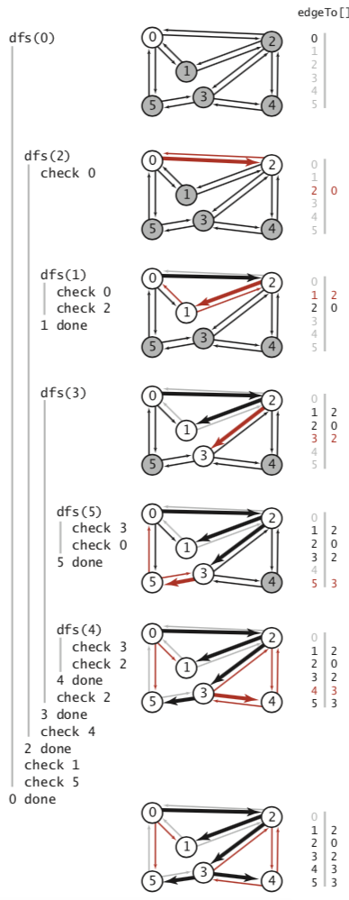

# 第4章 图

## 4.1 无向图

### 4.1.1 术语

### 4.1.2 表示无向图的数据类型

#### 4.1.2.1 图的几种表示方法

#### 4.1.2.2 邻接表的数据结构

```java
public class Graph {
    private final int V; //顶点数目
    private int E;//边的数目
    private Bag<Integer>[] adj;//邻接表
    //创建一个含有V个顶点但不含有边的图
    public Graph(int V){
        this.V= V;
        this.E = 0;
        adj = (Bag<Integer>[])new Bag[V]; //创建邻接表
        for (int v = 0; v < V; v++) { //将所有链表初始化为空
            adj[v] = new Bag<Integer>();
        }
    }

    //从标准输入流in读入一幅图
    public Graph(In in){
        this(in.readInt()); //读取V并将图初始化
        int E= in.readInt(); //读取E
        for (int i = 0; i < E; i++) {
            int v= in.readInt();//读取一个顶点
            int w = in.readInt();//读取另一个顶点
            addEdge(v,w);//添加一条连接他们的边
        }
    }
    public int V(){
        return V;
    }
    public int E(){
        return E;
    }
    //向图中添加一条边v-w
    void addEdge(int v,int w){
        adj[v].add(w);
        adj[w].add(v);
        E++;
    }
    //和v相邻的所有顶点
    Iterable<Integer> adj(int v){
        return adj[v];
    }
    @Override
    public String toString() {
        String s = V + "vertices," + E + "edges\n";
        for (int v = 0; v < V; v++) {
            s += v + ": ";
            for (int w : this.adj(v)) {
                s += w + " ";
            }
            s += "\n";
        }
        return s;
    }
}
```


#### 4.1.2.3 图的处理算法的设计模式

### 4.1.3 深度优先搜索

#### 4.1.3.1 走迷宫

```java
public class DepthFirstSearch {
    private boolean[] marked;
    private int count;
    public DepthFirstSearch(Graph G,int s){
        marked = new boolean[G.V()];
        dfs(G,s);
    }
    private void dfs(Graph G,int v){
        marked[v]=true;
        count++;
        for (int w : G.adj(v)) {
            if(!marked[w]) 
                dfs(G,w);
        }
    }
    public boolean marked(int w){
        return marked[w];
    }
    public int count(){
        return count;
    }
}
```

```java
public class TestSearch {
    public static void main(String[] args) {
        Graph G = new Graph(new In(args[0]));
        int s = Integer.parseInt(args[1]);
        DepthFirstSearch depthFirstSearch = new DepthFirstSearch(G, s);
        for (int v = 0; v < G.V(); v++) {
            if (depthFirstSearch.marked(v)) {
                StdOut.print(v + " ");
            }
        }
        StdOut.println();
        if (depthFirstSearch.count() != G.V()) {
            StdOut.print("NOT ");
        }
        StdOut.println("connected");
    }
}
```

```bash
% java TestSearch tinyG.txt 0 012345 6
NOT connected
% java TestSearch tinyG.txt 9
9 10 11 12
NOT connected
```


#### 4.1.3.2 热身

#### 4.1.3.3 单向通道

#### 4.1.3.4 跟踪深度优化搜索


#### 4.1.3.5 深度优化搜索的详细轨迹


### 4.1.4 寻找路径

#### 4.1.4.1 实现

```java
public class DepthFirstPaths {
    private boolean[] marked;
    private int[] edgeTo; //从起点到一个顶点的已知路径上的最后一个顶点
    private final int s;//起点

    public DepthFirstPaths(Graph G, int s) {
        marked = new boolean[G.V()];
        edgeTo = new int[G.V()];
        this.s = s;
        dfs(G, s);
    }

    private void dfs(Graph G, int v) {
        marked[v] = true;
        for (int w : G.adj(v)) {
            if (!marked[w]) {
                edgeTo[w] = v; //索引是终点，索引对应的值是起点即v
                dfs(G, w);
            }
        }
    }

    public boolean hasPathTo(int v) {
        return marked[v];
    }

    public Iterable<Integer> pathTo(int v) { //v是终点
        if (!hasPathTo(v)) return null;
        Stack<Integer> path = new Stack<>();//先进后出
        //s = 0
        //v = 3,x = 3, push 3
        //edgeTo[3] = 2，x=2,x != s成立 push 2
        //edgeto[2]=0,x=0,x != s不成立
        for (int x = v; x != s; x = edgeTo[x]) { 
            path.push(x);
        }
        path.push(s); //起点 push 0
        return path;
    }
}
```

```java
public class TestSearch {
    public static void main(String[] args) {
        Graph G = new Graph(new In(args[0]));
        int s = Integer.parseInt(args[1]);
        DepthFirstPaths search = new DepthFirstPaths(G, s);
        for (int v = 0; v < G.V(); v++) {
            StdOut.print(s + " to " + v + ": ");
            if (search.hasPathTo(v)) {
                for (int x : search.pathTo(v)) { 
                    if (x == s) StdOut.print(x); //起点
                    else StdOut.print("-" + x);
                }
            }
            StdOut.println();
        }
    }
}
```

```bash
% java Paths tinyCG.txt 0
0 to 0: 0
0 to 1: 0-2-1
0 to 2: 0-2
0 to 3: 0-2-3
0 to 4: 0-2-3-4
0 to 5: 0-2-3-5
```


#### 4.1.4.2 详细轨迹



### 4.1.5 广度优先搜索

深度优先搜索得到的路径不仅取决于图的结构，还取决于图的标识和递归调用的性质。

```java
public class BreadthFirstPaths {
    private boolean[] marked;//到达该项顶点的最短路径已知吗?
    private int[] edgeTo;//到达该顶点的已知路径上的最后一个顶点
    private final int s;//起点

    public BreadthFirstPaths(Graph G, int s) {
        marked = new boolean[G.V()];
        edgeTo = new int[G.V()];
        this.s = s;
        bfs(G, s);
    }

    private void bfs(Graph G, int s) {
        Queue<Integer> queue = new Queue<>();
        marked[s] = true;
        //顶点0被加入队列
        queue.enqueue(s);
        while (!queue.isEmpty()) {
            //从队列中删除顶点0并将它的相邻顶点2、1和5加入队列中。标记他们并分别将它们在
            //edgeTo[]中的值设为0
            //从队列中删除顶点2并检查它的相邻顶点0和1，发现两者都已经被标记。将相邻的顶点3
            //和4加入队列，标记它们并分别将它们在edgeTo[]中的值设为2。
            //从队列中删去顶点1并检查它的相邻顶点0和2、发现它们都已经被标记了。
            //从队列中删去顶点5并检查它的相邻顶点3和0、发现它们都已经被标记了。
            //从队列中删去顶点3并检查它的相邻顶点5、4和2、发现它们都已经被标记了。
            //从队列中删去顶点4并检查它的相邻顶点3和2、发现它们都已经被标记了。
            int v = queue.dequeue();
            for (int w : G.adj(v)) {
                if (!marked[w]) {
                    edgeTo[w] = v;
                    marked[w] = true;
                    queue.enqueue(w);
                }
            }
        }
    }

    public boolean hasPathTo(int v) {
        return marked[v];
    }

    public Iterable<Integer> pathTo(int v) {
        if (!hasPathTo(v)) return null;
        Stack<Integer> path = new Stack<>();
        for (int x = v; x != s; x = edgeTo[x]) {
            path.push(x);
        }
        path.push(s);
        return path;
    }
}
```


```java
public class TestSearch {
    public static void main(String[] args) {
        Graph G = new Graph(new In(args[0]));
        int s = Integer.parseInt(args[1]);
        BreadthFirstPaths search = new BreadthFirstPaths(G, s);
        for (int v = 0; v < G.V(); v++) {
            StdOut.print(s + " to " + v + ": ");
            if (search.hasPathTo(v)) {
                for (int x : search.pathTo(v)) {
                    if (x == s) StdOut.print(x);
                    else StdOut.print("-" + x);
                }
            }
            StdOut.println();
        }
    }
}
```

```text
% java BreadthFirstPaths tinyCG.txt 0
0 to 0: 0
0 to 1: 0-1
0 to 2: 0-2
0 to 3: 0-2-3
0 to 4: 0-2-4
0 to 5: 0-5
```


### 4.1.6 连通分量

深度优先搜索的下一个直接应用就是找出一幅图的所有连通分量。

```java
    public static void main(String[] args) {
        Graph G = new Graph(new In(args[0]));
        CC cc = new CC(G);
        int M = cc.count();
        StdOut.println(M + " components");
        Bag<Integer>[] components = (Bag<Integer>[]) new Bag[M];
        for (int i = 0; i < M; i++) {
            components[i] = new Bag<>();
        }
        for (int v = 0; v < G.V(); v++) {
            components[cc.id(v)].add(v);
        }
        for (int i = 0; i < M; i++) {
            for (int v : components[i]) {
                StdOut.print(v + " ");
            }
            StdOut.println();
        }
    }
```

```java
public class CC {
    private boolean[] marked;
    private int[] id; //v所在的连通分量的标识符
    private int count;

    public CC(Graph G) {
        marked = new boolean[G.V()];
        id = new int[G.V()];
        for (int s = 0; s < G.V(); s++) {
            if (!marked[s]) {
                dfs(G, s);
                count++;
            }
        }
    }

    private void dfs(Graph G, int v) {
        marked[v] = true;
        id[v] = count;
        for (int w : G.adj(v)) {
            if (!marked[w]) {
                dfs(G, w);
            }
        }
    }
    //判断v和w是否连通
    public boolean connected(int v, int w) {
        return id[v] == id[w];
    }
    //
    public int id(int v) {
        return id[v];
    }
    public int count() {
        return count;
    }
}
```

### 4.1.7 符号图

#### 4.1.7.1 API

#### 4.1.7.2 测试用例

#### 4.1.7.3 实现

