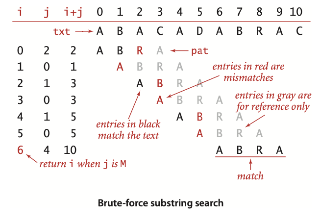

# 暴力子字符串查找算法



```java
public class BruteForce {
    public static int search(String pat, String txt) {
        int M = pat.length();
        int N = txt.length();
        //使用一个指针i追踪文本，一个指针j追踪模式。
        //对于每一个i，代码首先将j重置为0并不断将它增大，
        //直至找到了一个不匹配的字符或是模式结束（j==M)为止
        for (int i = 0; i <= N - M; i++) {
            int j;
            for (j = 0; j < M; j++) {
                if (txt.charAt(i + j) != pat.charAt(j)) {
                    break;
                }
            }
            if (j == M) return i;
        }
        return N;
    }
//    public static int search(String pat, String txt) {
//        int j, M = pat.length();
//        int i, N = txt.length();
//        for (i = 0, j = 0; i < N && j < M; i++) {
//            if (txt.charAt(i) == pat.charAt(j)) {
//                j++;
//            } else {
//                System.out.println("i="+i+"j="+j);
//                i = i - j;
//                j = 0;
//            }
//        }
//        if (j == M) return i - M;
//        else return N;
//    }
    public static void main(String[] args) {
        System.out.println(search("ABRA", "ABACADABRAC"));
    }
}
```


$$
x_{i}=t_{i} R^{M-1}+t_{i+1} R^{M-2}+\ldots+t_{i+M-1} R^{0}
$$

$$
\begin{aligned} x_{i+1} &=t_{i+1} R^{M-1}+t_{i+2} R^{M-2}+\ldots+t_{i+M} R^{0} \\ &=\left(t_{i+1} R^{M-2}+t_{i+2} R^{M-3}+t_{i+M-1} \cdot R^{0}\right) R+t_{i+m} \\ &=\left(x_{i}-t_{i} R^{M-1}\right) R+t_{i+M} \end{aligned}
$$

